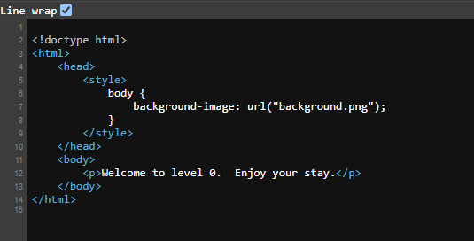

* * *
### HACKER101[`A little something to get you started`]
* * *
<hr>

It's been a while since I last touched the cybersecurity field, so I thought of brushing up my knowledge from scratch again. I decided to start using [Hacker101 CTF's](../../https://ctf.hacker101.com), which has proven to be a very good way to refresh all my knowledge. I recently felt the need to resume my study of web penetration testing strategies, and I discovered that Hacker101's CTF was a really helpful tool.

So let's dive in
If you have any experience interacting with web applications in ways other than your normal surfing habits, the first level of hacker101 is a simple CTF challenge. Taking this opportunity, I will stress how crucial it is to use a web proxy when performing any kind of web penetration testing. When going over the procedures required to locate even the smallest flag, this can be demonstrated.

First, we will look at the step it takes to find this flag without a standard web proxy.

The researcher must visit the page of the CTF:


While going through the CTF page it's just a blank page that says **Welcome to level 0. Enjoy your stay.**. Enjoy your stay it's, just don't fleet because you've come across nothing except the text

We can check what is being rendered on the web page by using **Developer Tools[F12]** or **Browser Source Code[Ctrl+U]**


As you can see we've just opened the Browsers source code and it contains HTML data. If we can slightly analyze the data being returned to us we can see theres a ``` <style>body {background-image: url("background.png");}</style> ``` code pointiong to an image that's not rendered to the page. If we can check the image out by appending it to the ctf url like this ```https://<id>.ctf.hacker101.com/background.png```. Whoola!!! we got our Flag in this format **^FLAG^b8a3e2977ada30100d0f700543f2628f8e638e331d6f92b8f80366715c4452c5$FLAG$**
### **[Home](../../index.html)**