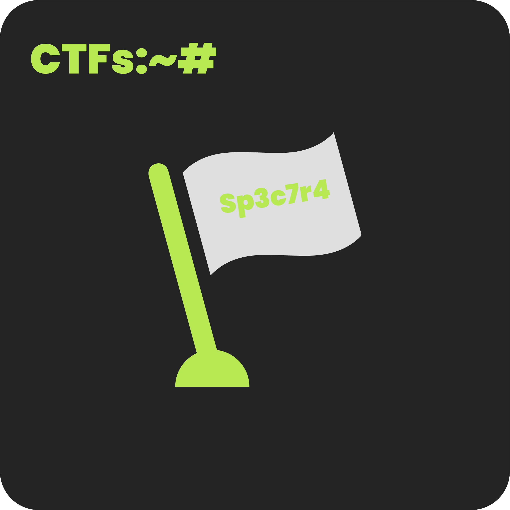
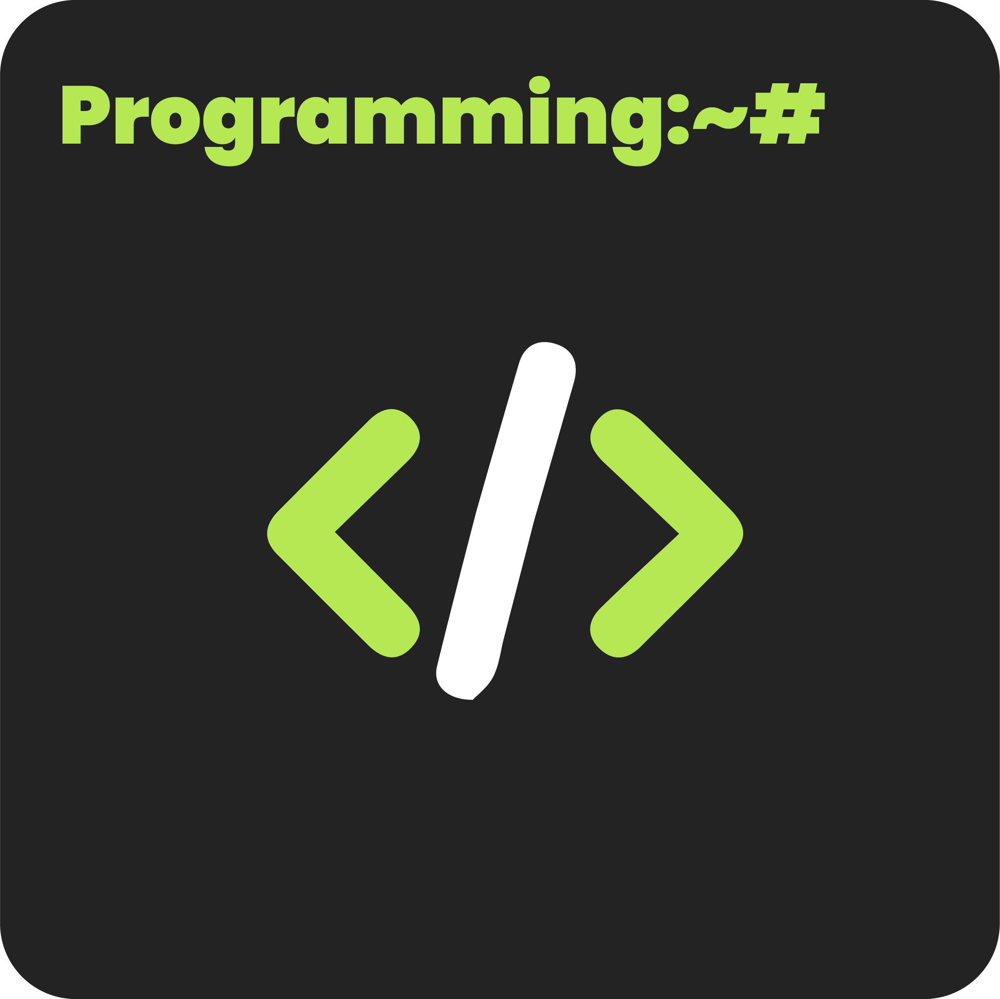

* * *
### Welcome To My Blog 
* * *

Yo 👋, Welcome To My Blog I'm Sp3c7r4. I Post Different Writeups, Articles, Any Stuffs Related To My Fields That I Learn 😉. 

* * *
### Whoami:~#
* * *

- **My Name:**    `Sarafa Satar`
- **Also Known As:** `Spectra`
- **What Do I Do:**  `Penetration Testing / Mobile App Development / Software Engineering`
- **Twitter:** [Sp3c7r4](https://twitter.com/sp3c7r4_gee){: target="_blank" }
- **Github:** [Git commit -m "sp3c7r4"](https://github.com/sp3c7r4){: target="_blank" }
- **My Resume** [Download here](https://raw.githubusercontent.com/sp3c7r4/sp3c7r4/356f8b9c17007279a83d6722dca742c5f4be80f3/Resume.pdf){: target="_blank" }
 

### **Top Articles:~#**
- [[July 16 2024]] [Linux Commands 101](./contents/Articles/posts/Linux101) 

### **Explore:~#**

 
 